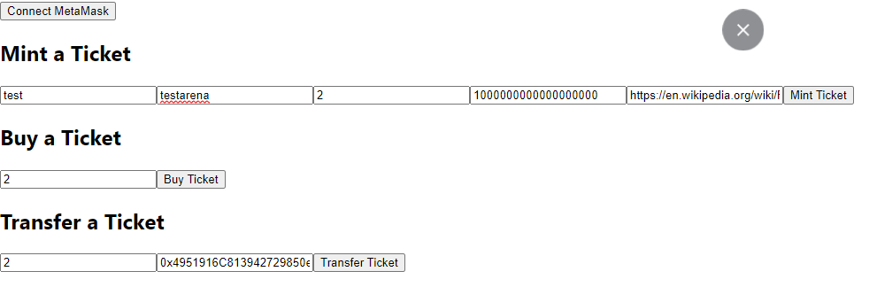

# Blockchain-based Ticketing System App

 

## Whitepaper

[Presentation](https://docs.google.com/presentation/d/e/2PACX-1vTeCu4wz8saTV0oo-YJ3ux_6FABDYBcd1hP6eJzpewAUdGmZaPDAiz82GqVSyz2HDWy8YVZDl0VWetC/pub?start=false&loop=false&delayms=5000)

## Project Brief: 
Overview of the Blockchain-Based Ticketing System App

A digital solution that makes use of blockchain technology to offer a ticketing platform that is both secure and transparent is the app for the blockchain-based ticketing system. Event organizers and attendees can manage and purchase tickets through the secure and user-friendly platform provided by the app. The app uses blockchain technology to make sure that all transactions are safe and can't be changed, so there's no risk of tickets being fake or stolen.

 

## Objectives: 
This project aims to create an app for a ticketing system based on the blockchain that can serve as a secure and transparent ticketing platform. Event attendees should be able to purchase and manage their tickets, and event organizers should be able to create events and tickets using the app. A safe payment gateway and a user-friendly interface for event organizers and attendees should also be included in the app.

 

## Features: 

The features of the blockchain-based ticketing system app will include:

* Creating an Event: Events can be created and ticket prices, dates, and other details can be set by event organizers.
* Ticket generation: The app will create one-of-a-kind digital tickets that will be saved on the blockchain and cannot be altered or duplicated.
* Sales of Tickets: Tickets can be purchased by attendees using a safe payment gateway through the app.
* Ticket Administration: The app lets attendees manage their tickets, including selling or transferring them to others.
* Blockchain Check: The app will check the ticket's blockchain record to see if it has been duplicated or altered to determine its authenticity.

 

## Project Components

1. Solidity
2. Python 
3. Truffle
4. React JS 
5. Ganache 
6. MetaMask

 

## Steps to install and execute the application

1. Install Node.js and npm (Node Package Manager): https://nodejs.org/en/download/

2. Install Truffle globally: 

    npm install -g truffle

3. Install Ganache GUI: https://www.trufflesuite.com/ganache

4. Install MetaMask browser extension: https://metamask.io/download.html

5. Install OpenZeppelin libraries: npm install @openzeppelin/contracts

6. Launch Ganache GUI and create a new workspace.

7. Add your project’s truffle-config.js file to the workspace.

8. Click “Save and Restart” to start the local Ethereum blockchain.

9. Open MetaMask and import one of the Ganache’s private keys.

10. In your terminal navigate to the "ticket-dapp" folder 

11. Run 

	truffle compile 

12. Run run 
	truffle migrate --reset 
   
13. Now your smart contract is compiled and deployed.

14. Go to your project directory and copy the "build" folder and its contents.

15. Navigate to the client > src directory and overwrite the build folder and its contents with the copy from step 14.

16. In your terminal, navigate to the "client" folder.

17. Install 

	npm install @metamask/detect-provider web3 @truffle/contract 
  
    in the client folder
18. Run 

	npm start 

    to start the React development server.

 

## Application Demo screenshots and Video

Application Screen to mint a ticket and then buy it and transfer it

Ganache showing the Ether being used for the transactions

Ganache showing the transactions happened

 

The video of the execution is available in the zip file shows how we run the complied code to mint the ticket and the buy it and also transfer the ticket.

 

## Next steps
1. Better User Interface with seperate logins for Event planner and Purchaser
2. Real-time Updates for the Event planners will be able to manage their events more effectively
3. Program royalty of secondary sales ([ERC-2981](https://eips.ethereum.org/EIPS/eip-2981))